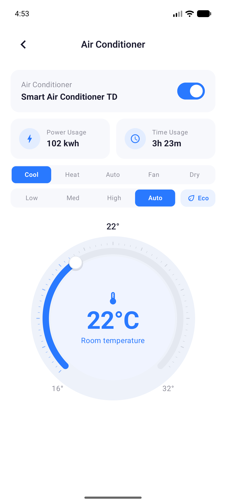

# Jetpack Compose New Style API

A small smart-home screen built to explore the new Jetpack Compose Foundation Style API.

The app is intentionally focused: one air-conditioner control screen, a clean Material 3-inspired visual system, and a few interactive states that show how styles can live outside regular composition while still reading the right theme values at the right time.

<p align="center">
  
</p>

## What This Sample Shows

- A centralized `AppTheme.styles` layer for reusable component styles.
- Style tokens resolved inside `StyleScope` with `CompositionLocal.currentValue`.
- Pressed, selected, and disabled states with `rememberUpdatedStyleState`.
- A compact climate control area with mode selector, fan speed, and Eco chip.
- A custom temperature gauge built with Compose Canvas.
- A simple MVVM-ish state flow using `ViewModel` and `StateFlow`.

## Why Style API?

The Style API makes component styling feel more like a first-class design-system layer. Instead of creating styles inside `@Composable` functions, this sample keeps styles as stable values and lets them resolve theme tokens when the style is actually applied.

That detail matters. Reading `MaterialTheme` or a `CompositionLocal.current` too early can freeze a color, shape, or typography value at creation time. Here, the style layer reads theme values like this:

```kotlin
val StyleScope.colorScheme: ColorScheme
    get() = LocalAppTheme.currentValue.colorScheme
```

So the style stays reusable, lightweight, and theme-aware.

## Project Shape

```text
app/src/main/java/com/ardakazanci/progsettings/
  components/        UI pieces like cards, controls, and the temperature gauge
  model/             Screen state models
  screen/            Screen and ViewModel
  ui/theme/          Material theme, app tokens, and Style API helpers
```

The most important files for the Style API experiment are:

- `ui/theme/AppStyles.kt`
- `ui/theme/StyleTheme.kt`
- `ui/theme/Theme.kt`
- `components/ClimateControls.kt`
- `components/TemperatureGauge.kt`

## Run

Open the project in Android Studio and sync Gradle, or build from the terminal:

```bash
./gradlew :app:assembleDebug
```

The project uses the experimental Foundation Style API, so the opt-in is configured at the Gradle compiler level.

## Notes

This is not a full smart-home app. It is a focused UI sample for trying the Style API in a real-ish component tree, with enough interaction to make style states useful without turning the sample into a large architecture project.
